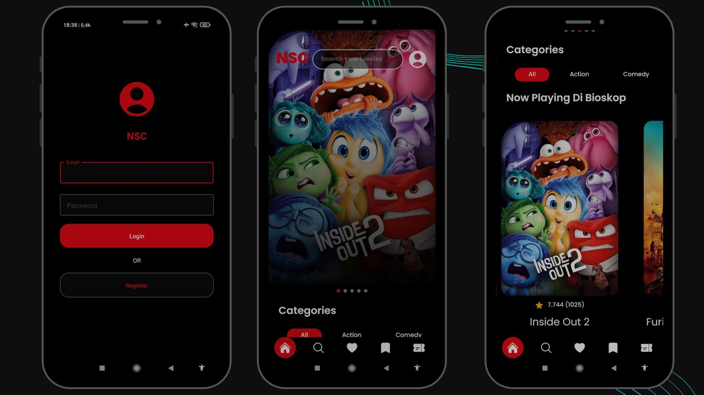
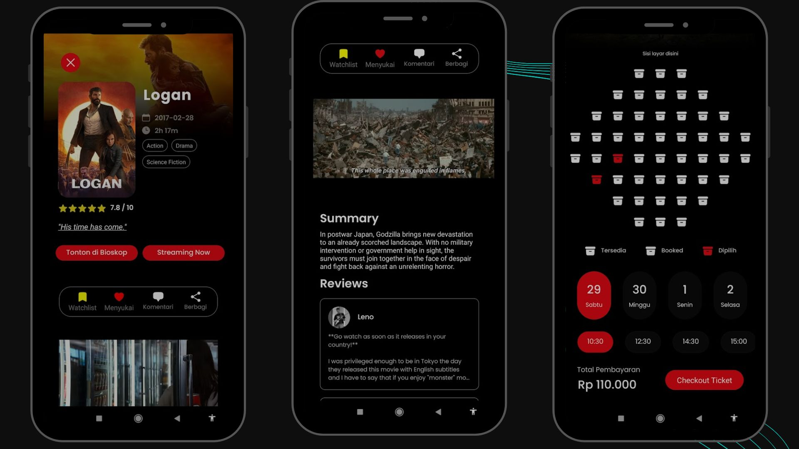
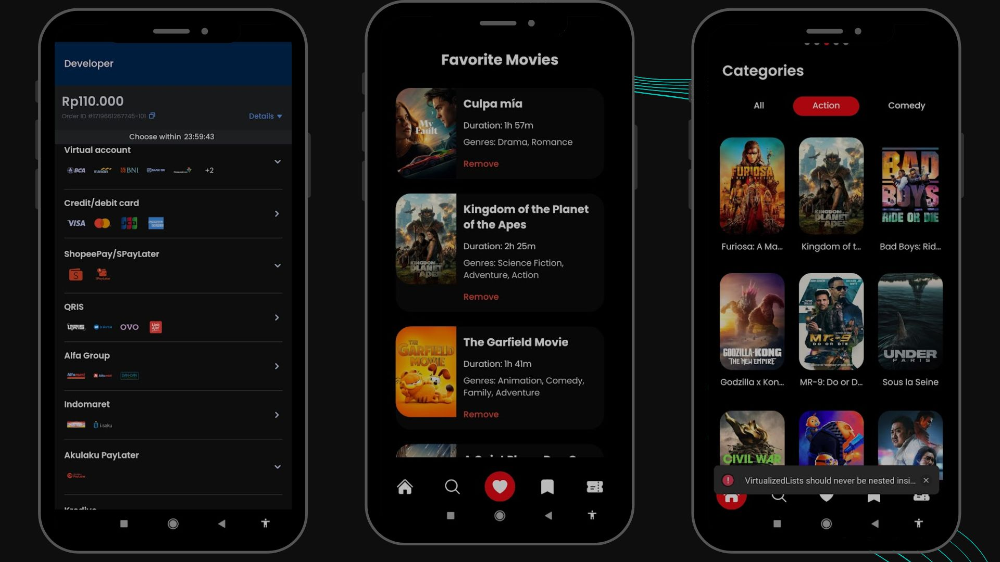

# Dokumentasi Proyek NSC Movie Ticketing App

## Deskripsi Proyek

**NSC Movie Ticketing App** adalah aplikasi yang dirancang untuk memudahkan pengguna dalam mendapatkan informasi film, memberikan ulasan, menambah film ke daftar favorit dan watchlist, serta memesan tiket bioskop dengan mudah. Aplikasi ini bertujuan untuk memberikan pengalaman menonton yang komprehensif dan memuaskan bagi pengguna.

## Latar Belakang

Bioskop NSC X Meirobie di Belitung adalah bioskop modern yang baru dibuka setelah hampir 22 tahun tidak ada bioskop di wilayah tersebut. Bioskop ini memiliki dua studio dengan kapasitas masing-masing 224 penonton. Terletak di Jl. Pilang, Desa Dukong, Kecamatan Tanjung Pandan, Kabupaten Belitung, Kepulauan Bangka Belitung.

**Masalah yang Dihadapi:**

1. Bioskop selalu ramai.
2. Penonton dari luar daerah kesulitan memesan tiket.
3. Kurangnya informasi tentang film yang sedang tayang.
4. Penonton tidak dapat mengetahui jadwal tayang film secara efisien.

**Solusi:** NSC Movie Ticketing App hadir untuk mengatasi masalah-masalah ini dengan memberikan berbagai fitur yang memudahkan pengguna dalam mendapatkan informasi dan memesan tiket.

## Fitur Utama

1. **Informasi Film Komprehensif:** Menyediakan detail lengkap tentang film, termasuk sinopsis, trailer video, dan ulasan pengguna.
2. **Kemudahan untuk Memberikan Suka dan Watchlist:** Pengguna dapat menandai film favorit dan menambahkannya ke daftar watchlist.
3. **Ulasan Film:** Pengguna dapat membaca dan memberikan ulasan tentang film.
4. **Kemudahan Booking dan Menentukan Lokasi Nonton:** Pemesanan tiket yang mudah dengan pilihan kursi, tanggal, dan waktu tayang.

## Struktur Proyek dan Teknologi yang Digunakan

### Struktur Direktori

- **./assets/preview-app/**: Lokasi gambar preview aplikasi.
- **./src/components/**: Lokasi komponen utama aplikasi.
- **./src/screens/**: Lokasi layar atau halaman utama aplikasi.

### Package yang Digunakan

1. **React Navigation:** Untuk navigasi antar halaman dalam aplikasi.
2. **Redux:** Untuk manajemen state global aplikasi.
3. **Firebase:** Untuk otentikasi dan otorisasi pengguna, serta penyimpanan data pengguna.
4. **Axios:** Untuk melakukan request HTTP ke server backend.
5. **React Native Paper:** Untuk membuat UI yang konsisten dan mudah digunakan.
6. **Midtrans:** Untuk gateway pembayaran.

### Penjelasan Komponen Utama

1. **Category Component:** Menampilkan kategori film yang dapat ditelusuri oleh pengguna.
2. **Review Component:** Menampilkan ulasan film dari pengguna lain.
3. **YouTube Player:** Memutar trailer video film.

### Penjelasan Layar Utama

1. **Login Screen:** Halaman masuk pengguna.
2. **Home Screen:** Halaman utama yang menampilkan film-film terbaru dan populer.
3. **Movie Detail Screen:** Halaman yang menampilkan detail film, termasuk sinopsis, trailer, dan ulasan.
4. **Booking Screen:** Halaman untuk memesan tiket, memilih kursi, tanggal, dan waktu tayang.
5. **Payment Screen:** Halaman pembayaran dengan Midtrans.
6. **Favorite Screen:** Halaman yang menampilkan film favorit pengguna.
7. **Watchlist Screen:** Halaman yang menampilkan daftar watchlist pengguna.

## Preview Aplikasi

Lokasi preview aplikasi terdapat di direktori: `./assets/preview-app/`

### Preview 1

**Terdapat Halaman:**
- Login Screen
- Home Screen
- Category Film

### Preview 2

**Terdapat Halaman:**
- Movie Detail Screen (Summary, Video Trailer, Review)
- Aksi Watchlist
- Aksi Suka
- Booking Screen (Bisa memilih kursi, menentukan tanggal, dan memilih jam)

### Preview 3

**Terdapat Halaman:**
- Pembayaran dengan Midtrans Gateway (terbuka Snap pembayarannya)
- Favorite Movie Screen
- Watchlist Movie Screen

## Kontributor dan Fitur yang Dikerjakan

1. **ATHA RIZKI PANGESTU **
2. **RAHMAT HIDAYAT**
   - Favorite Screen
   - Bookmark Screen
   - Login Screen
   - User Profile
   - Otentikasi dan Otorisasi dengan Firebase
3. **THEO SAMUEL DICUNAWI ARITONANG**
   - Category Component
   - Review Component
   - YouTube Player
4. **DIKA RIZKY AKBAR**
   - Pembuatan Endpoint
   - Fetching Fungsi
   - Search Screen

